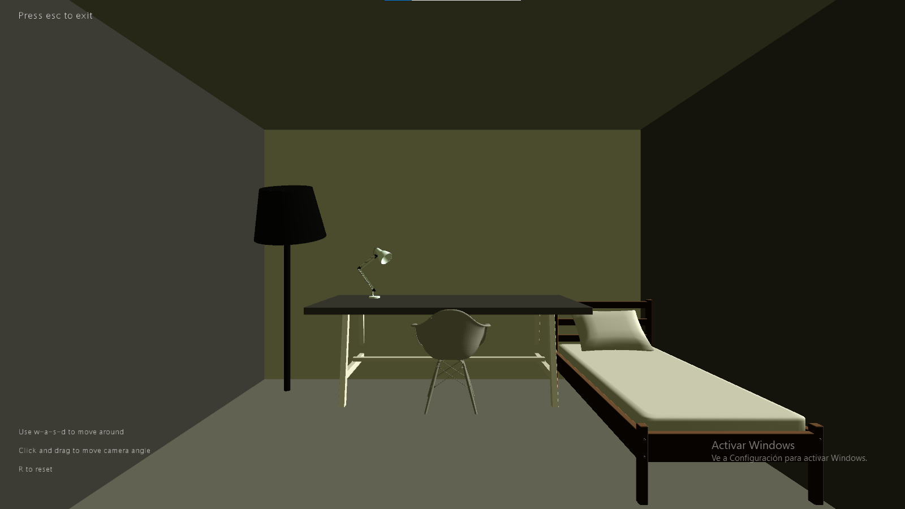

# Datos
Autor: Fernando Marcelo Alonso

Asignatura: Creando Interfaces de Usuario(CIU)

## Introducción
Esta práctica consiste en la creación de un escenario donde se jugue con las texturas y las luces.

## Implementación y argumentación

Para la implementación he usado Processing 3.5.4.

**Vista:** Solo hay una vista que es la básica desde la cual se puede observar el interior de una habitación.

**Luces:** Para las luces he usado dos tipos de luces una luz ambiental con un color más o menos marrón y una luz direccional, la luz direccional va rontando alrededor de la habitación para dar que se puede observar como afectan los distintos tipos de luces en la habitación.

**Movimiento:** Para el movimiento en la habitación he usado las teclas w-a-s-d pues son las más usadas para este tipo de movimiento.

**Ángulo cámara:** Se puede ajustar la dirección en la que se esta mirando pulsando en la pantalla y arrastrando en la dirección que queramos mover la cámara.

**Reset:** En cualquier momento si quisieramos resetear podriamos hacerlo pulsando la tecla r de reset.

**Posibles problemas:** Como he realizado esta práctica en un pantalla ultrawide no se si se verá distorsionado o movido de sitio los objetos de la habitación.

## GIF

